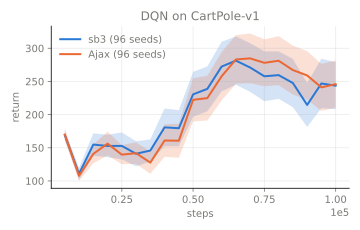
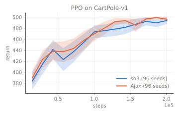
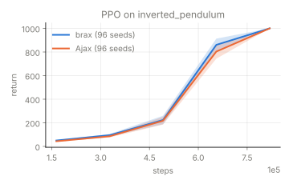
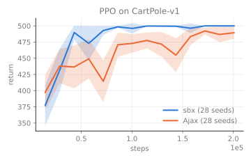
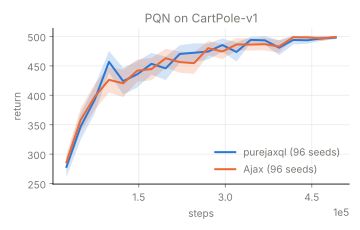
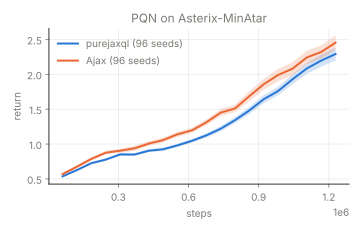
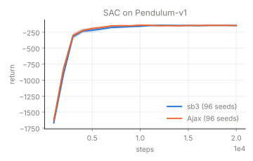
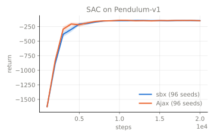
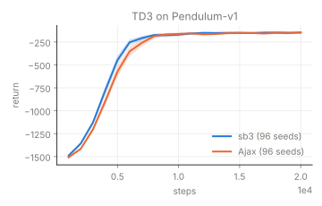

# Results

Written by `benchmarks/reference/refcmp_publish.py docs` from the
records the dataset publishes. Ajax is its matched arm. The
difference is Ajax's mean final return minus the reference's, with
its 95% bootstrap interval; the verdict sets that interval against the
registered margin. AdaStop names the difference it detected, and the
resolution is the smallest gap its budget detects 80% of the time.
Speed is measured on the CPU, medians over batches.

Each row reports its comparison's latest spec version, whose settings
the [specifications](specs.md) list, and the Ajax commit it ran.

| Comparison | Spec, Ajax | Verdict | Margin | Seeds | Reference | Ajax | Difference | AdaStop | Resolution |
|---|---|---|---|---|---|---|---|---|---|
| DQN | v2, 00f4bef | inconclusive | ±25 | 96 | 243.7 | 245.9 | +2.26 [-46.4, +50.9] | none shown | 72 |
| PPO | v3, 7d12582 | similar | ±25 | 96 | 493.8 | 496.1 | +2.22 [-5.12, +9.99] | none shown | 3.8 |
| PPO-inverted_pendulum | v1, df60228 | similar | ±50 | 96 | 1000 | 1000 | +0 [+0, +0] | none shown | 0 |
| PPO-sbx | v2, 7d12582 | similar | ±25 | 96 | 500 | 499.8 | -0.222 [-0.666, +0] | none shown | 0.0015 |
| PQN | v3, c2b3318 | similar | ±25 | 96 | 498 | 499 | +1.04 [-1.95, +4.29] | none shown | 0.011 |
| PQN-Asterix | v1, f1c5012 | inconclusive | ±0.115 | 96 | 2.292 | 2.455 | +0.162 [+0.0287, +0.298] | none shown | 0.2 |
| SAC | v2, 340ed65 | similar | ±14 | 96 | -146.7 | -148 | -1.25 [-7.92, +5.35] | none shown | 9.4 |
| SAC-sbx | v1, 8341743 | similar | ±14 | 96 | -147.2 | -148.5 | -1.28 [-8.16, +5.48] | none shown | 9.6 |
| TD3 | v2, da495af | similar | ±14 | 96 | -148.9 | -144.2 | +4.63 [-2.8, +12] | none shown | 12 |

## Speed

Each row names the machine its batches ran on; speeds from different
machines are not comparable.

| Comparison | Side | Steps per second | CPU seconds per 1M steps | Compile seconds | Machine |
|---|---|---|---|---|---|
| DQN | sb3 | 1,216 | 3,254 | 2.4 | Intel(R) Xeon(R) Gold 6134 CPU @ 3.20GHz, 32 cores |
| DQN | Ajax | 3,214 | 888 | 2.4 | Intel(R) Xeon(R) Gold 6134 CPU @ 3.20GHz, 32 cores |
| PPO | sb3 | 10,402 | 401 | 1.7 | Intel(R) Xeon(R) Gold 6134 CPU @ 3.20GHz, 32 cores |
| PPO | Ajax | 29,408 | 92 | 2.6 | Intel(R) Xeon(R) Gold 6134 CPU @ 3.20GHz, 32 cores |
| PPO-inverted_pendulum | brax | 15,876 | 246 | 56.1 | Intel(R) Xeon(R) Processor @ 2.10GHz, 4 cores |
| PPO-inverted_pendulum | Ajax | 10,094 | 225 | 30.5 | Intel(R) Xeon(R) Processor @ 2.10GHz, 4 cores |
| PPO-sbx | sbx | 16,458 | 377 | 5.4 | Intel(R) Xeon(R) Gold 6134 CPU @ 3.20GHz, 32 cores |
| PPO-sbx | Ajax | 29,464 | 93 | 2.6 | Intel(R) Xeon(R) Gold 6134 CPU @ 3.20GHz, 32 cores |
| PQN | purejaxql | 17,757 | 121 | 8.3 | Intel(R) Xeon(R) Processor @ 2.80GHz, 4 cores |
| PQN | Ajax | 25,134 | 96 | 1.3 | Intel(R) Xeon(R) Processor @ 2.80GHz, 4 cores |
| PQN-Asterix | purejaxql | 31,759 | 63 | 13.6 | Intel(R) Xeon(R) Processor @ 2.10GHz, 4 cores |
| PQN-Asterix | Ajax | 33,435 | 61 | 11.9 | Intel(R) Xeon(R) Processor @ 2.10GHz, 4 cores |
| SAC | sb3 | 164 | 23,620 | 4.8 | Intel(R) Xeon(R) Processor @ 2.80GHz, 4 cores |
| SAC | Ajax | 227 | 13,242 | 1.4 | Intel(R) Xeon(R) Processor @ 2.80GHz, 4 cores |
| SAC-sbx | sbx | 520 | 32,163 | 6.4 | Intel(R) Xeon(R) Gold 6134 CPU @ 3.20GHz, 32 cores |
| SAC-sbx | Ajax | 387 | 31,706 | 3.1 | Intel(R) Xeon(R) Gold 6134 CPU @ 3.20GHz, 32 cores |
| TD3 | sb3 | 175 | 22,334 | 4.9 | Intel(R) Xeon(R) Processor @ 2.80GHz, 4 cores |
| TD3 | Ajax | 179 | 17,257 | 1.5 | Intel(R) Xeon(R) Processor @ 2.80GHz, 4 cores |

## Learning curves

